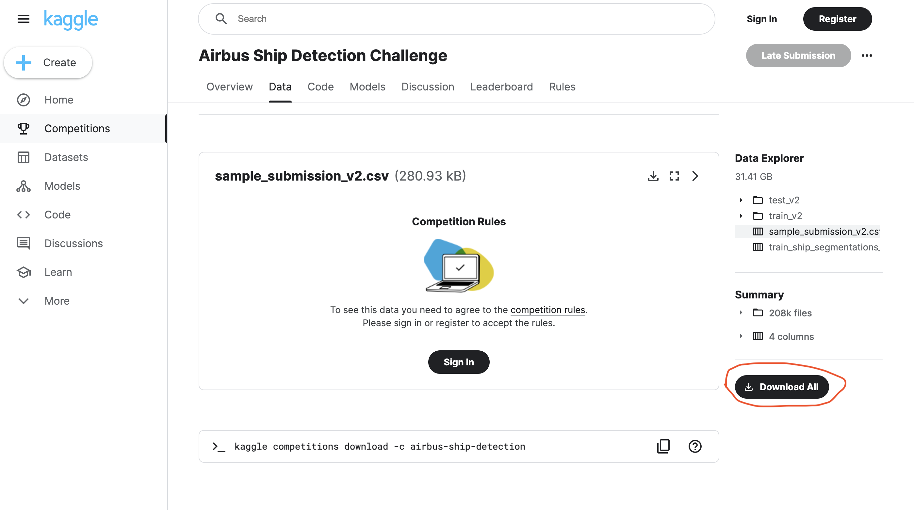

## Referenced paper:
[Attention Mask R-CNN for Ship Detection and Segmentation From Remote Sensing Images](https://ieeexplore.ieee.org/abstract/document/8951182/references#references)

## Dataset:
[Kaggle Airbus Ship Detection Challenge](https://www.kaggle.com/c/airbus-ship-detection/data)
After signing in and agrees to the competition rules, go to the bottom of the data page and click download all.

